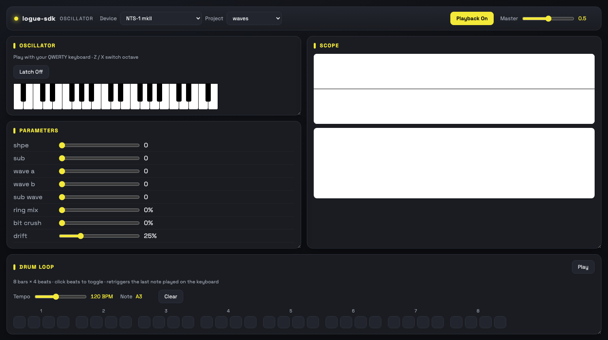
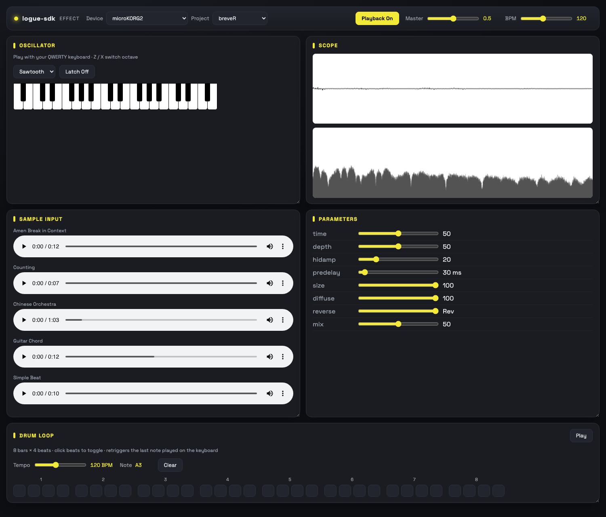
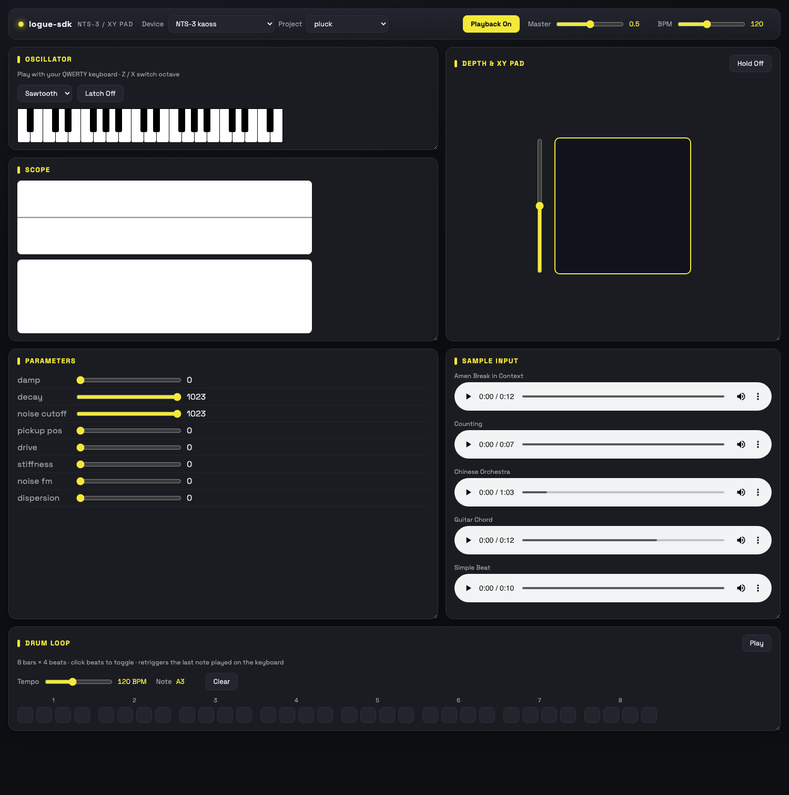

# websim — Web Audio Simulator for logue-sdk

`websim` lets you build a logue-sdk unit (oscillator or effect) into **WebAssembly** and
run it in a browser, with a virtual keyboard and live parameter sliders, instead of
flashing hardware on every change. Because the *same* processor class compiles to both
targets, what you hear in the browser is what ships to the synth.

> Supported platforms: **all six** logue-SDK targets —
> **NTS-1 mkII**, **NTS-3 kaoss** (gen-2), **microKORG2** (gen-2),
> **drumlogue** (gen-2, stereo), and **prologue / minilogue xd / NTS-1 mkI**
> (gen-1, via `nutekt-digital`). See the per-platform caveats under
> [Supported platforms & caveats](#supported-platforms--caveats).

## Screenshots

Every unit runs in one of three browser shells, each with a Device/Project switcher, a
default-on Playback toggle, drag-resizable panels, and a shared 8-bar **Drum Loop** step
sequencer.

**Oscillator shell** (`osc.html`) — on-screen keyboard, live parameter sliders, scope, drum loop
(here: NTS-1 mkII `waves`):



**Effect shell** (`fx.html`) — built-in sample/loop sources played through the effect, parameter
sliders, scope showing the processed signal (here: microKORG2 `breveR` reverb):



**X/Y pad shell** (`xypad.html`) — kaoss-pad-style X/Y control for NTS-3 generic FX
(here: NTS-3 `pluck`):



---

## Quick start — the root Makefile

A convenience [Makefile](Makefile) in the repository root wraps the whole flow so you don't
have to `cd` into emsdk or individual projects. Run all of these from the **repo root**.

```bash
make setup       # one-time: fetch the emsdk submodule + install/activate Emscripten
make list        # show every wasm-capable project
make websim      # build the default project (waves), open it in the browser, and offer
                 # every other unit in the Device/Project comboboxes — each compiled on
                 # demand (with a loading overlay) the first time you pick it
make websim-all  # eagerly build EVERY project into one tree and serve them together, so
                 # the same comboboxes switch units with no per-pick compile wait
```

Pick a different unit with `PROJECT` — either a full path or a bare project name:

```bash
make websim PROJECT=platform/nts-3_kaoss/pluck   # full path
make websim PROJECT=dummy-osc                     # bare name (resolved if unambiguous)
make clean  PROJECT=waves                          # remove that project's build/ and sim/
make help                                          # list all targets and variables
```

| Target | What it does |
|--------|--------------|
| `make setup` | `git submodule update --init tools/emsdk`, then `emsdk install latest && emsdk activate latest`. |
| `make list` | Auto-discovers projects that define a `wasm:` target (stays correct as projects are added). |
| `make websim` | Builds one project (default `platform/nts-1_mkii/waves`) into the co-serve tree and launches the **compile-on-demand dev server** ([websim/scripts/websim_server.py](websim/scripts/websim_server.py)): the **Device** + **Project** comboboxes list *every* unit, and picking one that isn't built yet compiles it (loading overlay) before loading. See [Switching devices & projects](#switching-devices--projects-in-the-browser). |
| `make websim-all` | Eagerly builds every (or `PROJECTS="..."`) unit into one co-served tree (served by `emrun`) so the same comboboxes switch units with no per-pick compile. |
| `make clean` | Runs the project's `make clean` (removes `build/` and `sim/`). |
| `make help` | Shows usage. This is the default target. |

Notes:

- **`PROJECT` resolution**: a value with a `Makefile` is used as a path; otherwise it's
  matched as a bare name. A name that exists on more than one platform (e.g. `pluck`, on both
  NTS-1 mkII and NTS-3) is rejected with the candidates listed — re-run with the full path.
- **Bootstrap is self-healing**: `make setup` unsets stale `EMSDK_PYTHON` / `EMSDK_NODE` /
  `SSL_CERT_FILE` for the install so a previously-sourced `emsdk_env.sh` can't break the very
  download meant to populate those paths (see [Troubleshooting](#troubleshooting)).
- **Windows**: run these from **Git Bash**, **MSYS2**, or **WSL** (the Makefile needs Unix
  `make`); plain `cmd`/PowerShell won't work. See [Windows](#windows) below.

The sections below document the same steps done **by hand** (and explain what the Makefile
runs under the hood).

---

## Switching devices & projects in the browser

Both `make websim` and `make websim-all` give every shell page (`osc` / `fx` / `xypad`) a
**Device** and a **Project** combobox in its topbar, populated from a generated `projects.json`
by [websim/scripts/websim-selector.js](websim/scripts/websim-selector.js). They differ only in
*when* units are compiled:

- **`make websim`** builds just the project you asked for, then serves the tree through the
  **compile-on-demand dev server** ([websim/scripts/websim_server.py](websim/scripts/websim_server.py)).
  The combobox lists **every** wasm-capable unit, with the current one preselected. Picking one
  that's already built loads it immediately; picking one that isn't yet built calls
  `GET /api/compile?project=<platform>/<project>`, which runs `make wasm-build` for that unit
  into the same tree and returns its page — a **loading overlay** covers the compile + reload
  (and shows the build log if it fails). The tree doubles as a build cache, so a unit you've
  already visited reloads instantly.
- **`make websim-all`** eagerly builds every (or `PROJECTS="..."`) unit up front and serves the
  tree with `emrun`. Every listed unit is already built, so switching never waits on a compile.
  Build a subset to keep the up-front build fast (all units with `-O2` takes a while):

  ```bash
  make websim-all PROJECTS="platform/nts-1_mkii/waves platform/microkorg2/waves"
  ```

The co-serve tree looks like:

```
websim/sim/
  index.html                 # redirects to the default / current unit
  projects.json              # generated manifest (devices -> projects: id/name/shell/built/page)
  <platform>/<project>/<project>.html  (+ .js / .wasm / copied assets)
```

Switching is always a **full page load**: each unit is a separate WebAssembly build wrapped in
its own UI shell, so the correct shell and that unit's parameter sliders are rebuilt from
scratch. Picking a **device** repopulates the project list and loads that device's first
project. When a single unit is served standalone by an in-project `make wasm` (no manifest),
`projects.json` 404s and the selector hides itself — that page looks exactly as before.

The manifest + landing page are produced by [websim/gen_manifest.py](websim/gen_manifest.py)
(pass `--projects` to also list units that aren't built yet); the underlying build-only step is
the `wasm-build` target in [websim/wasm.mk](websim/wasm.mk).

---

## How it works

The same unit source compiles to two targets:

- `make install` → `arm-none-eabi-gcc` → stripped `.nts1mkiiunit` / `.nts3unit` ELF for the hardware.
- `make wasm` → **Emscripten (`emcc`)** → a browser app. Same `unit.cc` / processor class, different backend.

### The `make wasm` target

Defined per project (e.g. [platform/nts-1_mkii/waves/Makefile](platform/nts-1_mkii/waves/Makefile#L247-L266)).
It bypasses the entire ARM toolchain and instead:

1. **Stages a `sim/` dir** next to the project — copies the shared front-end assets from
   [websim/](websim/) (`samples/`, `scripts/`, `images/`) plus the sources.
2. **Assembles `WASMSRC`** — `wasm.cc` + your `UCSRC`/`UCXXSRC` + `websim/dsp/*.c` +
   `websim/dsp/*.cpp`. Note what's *missing* vs. the hardware build: no `_unit_base.c`, no
   CMSIS, no linker script.
3. **Invokes `emcc`** with the key flags:
   - `-s AUDIO_WORKLET=1 -s WASM_WORKERS=1` → run the DSP in a Web Audio AudioWorklet on a
     dedicated worker thread (the browser analog of the MCU audio callback).
   - `-lembind` → enable C++↔JS bindings.
   - `--shell-file <osc|fx|xypad>.html` → wrap the module in the HTML harness (this is the UI).
   - `--emrun -O2 -g` → instrumented for `emrun` serving, optimized, with debug info.
   - Output: `sim/<project>.html` (+ `.js` / `.wasm` / worker siblings).
4. **Serves** via `emrun --browser chrome --serve_after_close` — a local HTTP server.
   (AudioWorklet + SharedArrayBuffer require cross-origin isolation headers and a real
   origin; it will **not** work from a `file://` URL.)

### `wasm.cc` — the host-side bridge

The WASM analog of `_unit_base.c` (e.g. [platform/nts-1_mkii/waves/wasm.cc](platform/nts-1_mkii/waves/wasm.cc)). It:

- Instantiates the processor (`Osc processor;`), which derives from the common `Processor`
  interface (`init`, `process`, `setParameter`, `noteOn`, `setPitch`, `getBufferSize`…).
- Sets up the Web Audio graph in `main()` (48 kHz `AudioContext` → worklet thread →
  `ProcessAudio` render callback). For each 128-sample quantum it pushes k-rate params into
  `processor.setParameter()`, calls `processor.process()`, and copies the result to output.
- Exposes controls to JS via `EMSCRIPTEN_BINDINGS` (`getValidParameters`,
  `getParameterValueString`, `setOscPitch`, `noteOn`, `noteOff`, `fx_set_bpm`). Parameter
  metadata is read straight from the unit's `unit_header` — the same header the hardware uses.

### `websim/dsp/` — faking the firmware ROM

On hardware, the runtime API (`osc_sinf`, wavetables) and lookup tables (`tanh_lut`,
`pow2_lut`, `wavetable_lut`, `waves-a..f.c`, …) live in firmware ROM and are linked at fixed
addresses. The browser has none of that, so [websim/dsp/osc_api.cpp](websim/dsp/osc_api.cpp)
and [websim/dsp/fx_api.cpp](websim/dsp/fx_api.cpp) are **host re-implementations** of the
runtime API, and the `*_lut.c` / `waves-*.c` files supply the ROM data as ordinary compiled
symbols. That's why they're appended to `WASMSRC`.

### The HTML shells — the UI

The `--shell-file` becomes the page. There are three, one per unit kind:

| Shell | Unit type | UI |
|-------|-----------|----|
| [websim/osc.html](websim/osc.html) | oscillators | on-screen MIDI keyboard (`qwerty-hancock.js`) + param sliders |
| [websim/fx.html](websim/fx.html)   | effects     | plays an input sample/loop through the effect + param sliders |
| [websim/xypad.html](websim/xypad.html) | NTS-3 generic FX | kaoss-pad style X/Y control + param sliders |

The embedded JS builds sliders dynamically from `Module.getValidParameters()`, routes the
keyboard to `Module.noteOn` / `noteOff` / `setOscPitch`, and is bootstrapped by
`setupWebAudioAndUI(context, wasmProcessor)`, which the C++ calls via `EM_ASM` once the
worklet node exists.

#### Shared shell chrome

All three shells wrap their unit-specific UI in the same topbar and panel furniture:

- **Device / Project comboboxes** to switch units without leaving the page (see
  [Switching devices & projects](#switching-devices--projects-in-the-browser)), plus a **Master**
  volume slider and — on `fx`/`xypad` — a **BPM** slider.
- A **Playback** toggle that is **on by default** and remembered in `sessionStorage`, so it stays
  enabled across the full-page reload that switching units performs. (The browser's autoplay
  policy still gates `AudioContext.resume()` on a user gesture, so the button shows "on"
  optimistically and audio actually starts on your first key press / input-source play.)
- **Drag-resizable panels** — grab the bottom-right corner of any panel to resize it, so a tall
  panel (e.g. the drum sequencer) can't squash the others; the page scrolls instead of clipping.
- A shared **Drum Loop** step sequencer ([websim/scripts/drum-loop.js](websim/scripts/drum-loop.js)):
  an 8-bar × 4-beat grid that retriggers the last note you played on the keyboard as a short
  percussive blip, with a tempo slider (40–240 BPM), a clear button, and a moving playhead. It
  schedules off the Web Audio clock with a `setInterval` lookahead (the standard "two clocks"
  pattern) so timing stays steady regardless of main-thread jitter. The `osc` shell drives the
  wasm voice directly (`setOscPitch` / `noteOn` / `noteOff`); the `fx` and `xypad` shells gate a
  continuously running `OscillatorNode` through the effect.

### Data flow

```
unit.cc (your DSP, Processor subclass)
        │  + wasm.cc (bridge) + websim/dsp/* (ROM stand-ins)
        ▼  emcc -s AUDIO_WORKLET=1 --shell-file osc.html
   <project>.html / .js / .wasm / worker   →  emrun (chrome)
        │
   AudioWorklet thread: ProcessAudio() ──calls──▶ processor.process()
        ▲                                              │ output
   HTML UI (keyboard/X-Y + sliders) ──Embind──▶ noteOn/setParameter/setOscPitch
```

---

## Prerequisites (all platforms)

- **git** (to fetch the `emsdk` submodule).
- **Python 3** (used by emsdk, `emrun`, and the param/render helper scripts — stdlib only, no
  numpy/scipy).
- **GNU make**.
- **Emscripten** — pin a recent version (CI uses **4.0.16**). Minimum **3.1.x+**: the drumlogue
  units need SIMDe's `<arm_neon.h>` (built with `-msimd128`), and recent emsdk **rejects**
  `-I.../emscripten/system/include` (emcc resolves its own system headers via the sysroot, so the
  build must not add it). `make setup` installs `latest`; pin a version for reproducibility
  (`cd tools/emsdk && ./emsdk install 4.0.16 && ./emsdk activate 4.0.16`).
- **Google Chrome** — the `wasm` target hardcodes `emrun --browser chrome`. Install Chrome,
  or edit the target to use another browser (see [Troubleshooting](#troubleshooting)).
- The ARM GCC toolchain is **not** required for `make wasm` (only `emcc` is used).

---

## One-time setup: install Emscripten (emsdk)

> This is what `make setup` automates. Use it if you prefer to run the steps by hand or
> need to debug the install.

The `emsdk` lives as a git submodule at [tools/emsdk](tools/emsdk) and must be checked out
and activated once. Run from the **repository root**.

### Linux / macOS

```bash
# 1. fetch the emsdk submodule
git submodule update --init tools/emsdk

# 2. install and activate the latest Emscripten
cd tools/emsdk
./emsdk install latest
./emsdk activate latest
cd ../..
```

> macOS: if you don't have the developer tools, run `xcode-select --install` first.
> Use the system `python3`, or install via Homebrew (`brew install python git`).
> Chrome must be in `/Applications`.

### Windows

Use **PowerShell** or **cmd** for the emsdk install. Note that the project Makefiles need a
Unix-style `make`, so you'll run the actual build from **Git Bash**, **MSYS2**, or **WSL**
(see the build section). Pick one approach and stay in it.

**Native (PowerShell):**

```powershell
# 1. fetch the emsdk submodule
git submodule update --init tools/emsdk

# 2. install and activate the latest Emscripten
cd tools\emsdk
.\emsdk.bat install latest
.\emsdk.bat activate latest
cd ..\..
```

**WSL (recommended on Windows):** open a WSL (Ubuntu) shell and follow the **Linux**
instructions above. This avoids the `make`/path issues entirely.

---

## Build & run a unit

> `make websim PROJECT=<name>` (from the repo root) does this for you. The steps below are
> the manual equivalent — running `make wasm` directly inside a project.

Run `make wasm` from inside any wasm-capable project directory (across all six platforms). The
target builds the `.wasm`, writes everything into a `sim/` subfolder, then launches a local
server and opens Chrome. (`make list` from the repo root prints every project.)

Projects you can try:

| Project | Type | Shell |
|---------|------|-------|
| [platform/nts-1_mkii/waves](platform/nts-1_mkii/waves) | oscillator | osc |
| [platform/nts-1_mkii/dummy-osc](platform/nts-1_mkii/dummy-osc) | oscillator template | osc |
| [platform/nts-1_mkii/pluck](platform/nts-1_mkii/pluck) | oscillator | osc |
| [platform/nts-1_mkii/dummy-modfx](platform/nts-1_mkii/dummy-modfx) | effect template | fx |
| [platform/nts-1_mkii/dummy-delfx](platform/nts-1_mkii/dummy-delfx) | effect template | fx |
| [platform/nts-1_mkii/dummy-revfx](platform/nts-1_mkii/dummy-revfx) | effect template | fx |
| [platform/nts-3_kaoss/pluck](platform/nts-3_kaoss/pluck) | generic FX | xypad |
| [platform/nts-3_kaoss/dummy-genericfx](platform/nts-3_kaoss/dummy-genericfx) | generic FX template | xypad |
| [platform/microkorg2/waves](platform/microkorg2/waves) | oscillator (gen-2) | osc |
| [platform/microkorg2/vox](platform/microkorg2/vox) | oscillator (formant, NEON) | osc |
| [platform/microkorg2/dummy-osc](platform/microkorg2/dummy-osc) | oscillator template | osc |
| [platform/microkorg2/dummy-modfx](platform/microkorg2/dummy-modfx) | effect template | fx |
| [platform/microkorg2/dummy-delfx](platform/microkorg2/dummy-delfx) | effect template | fx |
| [platform/microkorg2/dummy-revfx](platform/microkorg2/dummy-revfx) | effect template | fx |
| [platform/microkorg2/MorphEQ](platform/microkorg2/MorphEQ) | morphing EQ (modfx) | fx |
| [platform/microkorg2/Vibrato](platform/microkorg2/Vibrato) | vibrato (modfx) | fx |
| [platform/microkorg2/MultitapDelay](platform/microkorg2/MultitapDelay) | multitap delay (delfx) | fx |
| [platform/microkorg2/breveR](platform/microkorg2/breveR) | reverb (revfx) | fx |
| [platform/drumlogue/dummy-synth](platform/drumlogue/dummy-synth) | synth (stereo) | osc |
| [platform/drumlogue/sample-voice](platform/drumlogue/sample-voice) | sample-playback drum voice | osc |
| [platform/drumlogue/dummy-delfx](platform/drumlogue/dummy-delfx) | effect template (stereo) | fx |
| [platform/drumlogue/dummy-revfx](platform/drumlogue/dummy-revfx) | effect template (stereo) | fx |
| [platform/drumlogue/dummy-masterfx](platform/drumlogue/dummy-masterfx) | master FX (4-in/2-out) | fx |
| [platform/nutekt-digital/waves](platform/nutekt-digital/waves) | oscillator (gen-1) | osc |
| [platform/nutekt-digital/twosaw](platform/nutekt-digital/twosaw) | detuned dual-saw osc example (gen-1) | osc |
| [platform/nutekt-digital/tremolo](platform/nutekt-digital/tremolo) | modfx example (gen-1) | fx |
| [platform/minilogue-xd/waves](platform/minilogue-xd/waves) | oscillator (gen-1) | osc |
| [platform/prologue/waves](platform/prologue/waves) | oscillator (gen-1) | osc |

### Supported platforms & caveats

| Platform | SDK | Status | Caveats |
|----------|-----|--------|---------|
| NTS-1 mkII | gen-2 | full | — |
| NTS-3 kaoss | gen-2 | full | X/Y pad shell |
| microKORG2 | gen-2 | full (osc + fx, incl. real units) | osc is single-voice by default; `vox` runs **4-voice** polyphony (opt-in `MK2_OSC_VOICES`, round-robin allocator, ≤`kMk2BufferSize` sub-blocks). The NEON-heavy real units (`vox`, `MorphEQ`, `MultitapDelay`, `Vibrato`, `breveR`) build via a struct-shape SIMD shim (`websim/dsp/microkorg2/mk2_simd_compat.h` + a shadow `arm_neon.h`) instead of SIMDe — see [WEBSIM_FOLLOWUP_PLAN.md](docs/plans/WEBSIM_FOLLOWUP_PLAN.md) §A, §D |
| drumlogue | gen-2 | synth + fx (incl. sample playback) | stereo; NEON via SIMDe (`-msimd128`); sample-bank accessors are backed by a **synthetic** host bank (`websim/dsp/drumlogue/dl_sample_bank.h`) so sample units like `sample-voice` play — not the device's real PCM; `masterfx` is fed the stereo source duplicated to 4 input channels |
| prologue / minilogue xd / NTS-1 mkI | gen-1 | osc + fx | separate q31 osc harness (`legacy_osc_bridge.h`) + a float fx harness (`legacy_fx_bridge.h`, modfx/delfx/revfx; `tremolo` is a worked modfx example); pitch via note table; same unified `make websim PROJECT=...` command |

The infrastructure is shared: every project includes `websim/wasm.mk` (gen-2) or
`websim/legacy.mk` (gen-1); per-platform firmware-ROM stand-ins and host bridges live under
`websim/dsp/<platform>/`.

### Linux / macOS

```bash
cd platform/nts-1_mkii/waves
make wasm
```

Chrome opens automatically at a `localhost` URL served by `emrun`. Play with the on-screen
keyboard and parameter sliders. Press `Ctrl-C` in the terminal to stop the server
(`--serve_after_close` keeps it alive until you do).

### Windows

Run from a shell that provides Unix `make` and resolves the emsdk paths in the Makefile:

**Git Bash or MSYS2:**

```bash
cd platform/nts-1_mkii/waves
make wasm
```

**WSL:** identical to the Linux steps above.

> Plain `cmd`/PowerShell usually lack `make` and won't resolve the Makefile's Unix-style
> tool paths, so prefer Git Bash, MSYS2, or WSL.

### Iterating

Edit your DSP in `unit.cc` (or the project headers) and re-run `make wasm`. To start clean,
`make clean` removes both the `build/` and `sim/` directories.

---

## Headless audio checks (offline render harness) {#headless-render}

`make wasm` needs a browser to hear anything, which CI and headless agents can't observe. The
**offline render harness** builds the *same* DSP (same bridge, same SIMD shim — only the
AudioWorklet front-end is swapped out) and runs it under emsdk's bundled **node**, dumping a
32-bit-float WAV. What you measure here is what the browser plays.

```bash
# one project -> sim/<project>.render.wav (defaults: osc note 60/69, 1 s; fx sine in)
make render PROJECT=platform/microkorg2/vox
make render PROJECT=platform/microkorg2/vox WEBSIM_RENDER_ARGS="out.wav 69 375"   # out, note, blocks
make render PROJECT=platform/microkorg2/breveR WEBSIM_RENDER_ARGS="rev.wav impulse" # fx: sig=sine|impulse

# every render-capable project, asserting finite (no NaN/Inf) output — the CI smoke
make render-all
```

`render-all` covers every project whose `wasm.cc` uses a shared bridge with a render path
(microKORG2 osc/fx, drumlogue synth/fx, gen-1 osc). The inline **NTS-1 mkII / NTS-3** bridges
don't have a render `main` yet, so they're skipped (browser only).

Analyse a render with the stdlib-only checker (no numpy/scipy needed):

```bash
python3 websim/scripts/check_render.py FILE.wav                       # health: peak/rms/NaN
python3 websim/scripts/check_render.py FILE.wav --expect-hz 440 --tol-cents 50   # osc pitch gate
python3 websim/scripts/check_render.py FILE.wav --min-rms 1e-4        # fail if silent
python3 websim/scripts/check_render.py FILE.wav --peaks 220,261.63,329.63   # poly chord: all present
```

For polyphonic units, render a chord and check every tone is present:

```bash
make render PROJECT=platform/microkorg2/vox WEBSIM_RENDER_ARGS="vox.wav 57,60,64"
python3 websim/scripts/check_render.py vox.wav --peaks 220,261.63,329.63   # A-minor triad
```

It exits non-zero on failure, so it drops straight into CI. For oscillators it estimates the
fundamental by autocorrelation; e.g. `vox` and the gen-1 `waves` both render note 69 at ~440 Hz.
Checks are tolerance-based, not bit-exact (the wasm build scalarises NEON, so it won't match the
ARM build sample-for-sample).

### Manual per-unit browser smoke checklist

For changes that need a real ear/eye (every slider, the keyboard, the UI), open the unit with
`make websim PROJECT=...` and confirm:

- [ ] the page loads **cross-origin-isolated** (no "SharedArrayBuffer is not defined" in the console);
- [ ] playback is **on by default** (the Playback button shows selected) and audio starts on the first user gesture (key press / input-source play);
- [ ] for oscillators: the on-screen keyboard changes pitch; for effects: the input loop plays through;
- [ ] **every** slider audibly changes the sound (sweep each end);
- [ ] no errors or `NaN`/denormal warnings in the browser console;
- [ ] switching units via the Device/Project comboboxes reloads cleanly — including an **unbuilt** unit under `make websim` (loading overlay → compiles → loads).

---

## Troubleshooting

- **`emcc: command not found` / wrong emcc:** the Makefile calls emcc by absolute path
  (`tools/emsdk/upstream/emscripten/emcc`), so you must have run `emsdk install latest` &&
  `emsdk activate latest`. You generally do **not** need to source `emsdk_env`, but doing so
  doesn't hurt: `source tools/emsdk/emsdk_env.sh` (Linux/macOS) or
  `tools\emsdk\emsdk_env.bat` (Windows).
- **Chrome not found / want a different browser:** the `wasm` target ends with
  `emrun --browser chrome ...`. Change `chrome` to `firefox` (or your browser), or remove
  `--browser chrome` to use the system default. You can also serve without auto-opening and
  navigate manually to the printed `localhost` URL.
- **No audio / "SharedArrayBuffer is not defined" / worklet errors:** the page must be
  served cross-origin-isolated. Always open it through `emrun` (the `make wasm` flow does
  this) — never via a `file://` path or a plain static server without COOP/COEP headers.
- **Submodule is empty:** `tools/emsdk` is a git submodule; if it's empty run
  `git submodule update --init tools/emsdk` (or `make setup` from the root).
- **`make setup` fails with a missing python or CA file** — e.g.
  `.../python/3.13.3_64bit/bin/python3: No such file or directory` (exit 126), or
  `curl: (77) error setting certificate verify locations: CAfile: .../certifi/cacert.pem`
  (exit 77): your shell sources `emsdk_env.sh` (commonly added to `~/.zprofile`/`~/.bashrc`),
  which exports `EMSDK_PYTHON` / `EMSDK_NODE` / `SSL_CERT_FILE` pointing into bundled tool
  dirs. On a fresh checkout those dirs aren't downloaded yet, so the stale paths break the
  install that's supposed to create them. The root `make setup` already unsets these for the
  bootstrap; to run the raw emsdk commands by hand, do the same:
  `env -u EMSDK_PYTHON -u EMSDK_NODE -u SSL_CERT_FILE ./emsdk install latest`. Once the
  install completes the bundled dirs exist and your sourced `emsdk_env.sh` is valid again.
- **Stale build:** run `make clean` in the project dir (or `make clean PROJECT=<name>` from
  the root), then build again.

---

## Notes

- The Docker container under [docker/](docker/) is for building **hardware** units in an
  OS-agnostic way; the web sim needs a local emsdk **and a browser**, so run `make wasm` on
  the host rather than in that container.
- See [websim/README.md](websim/README.md) for KORG's original short notes.
